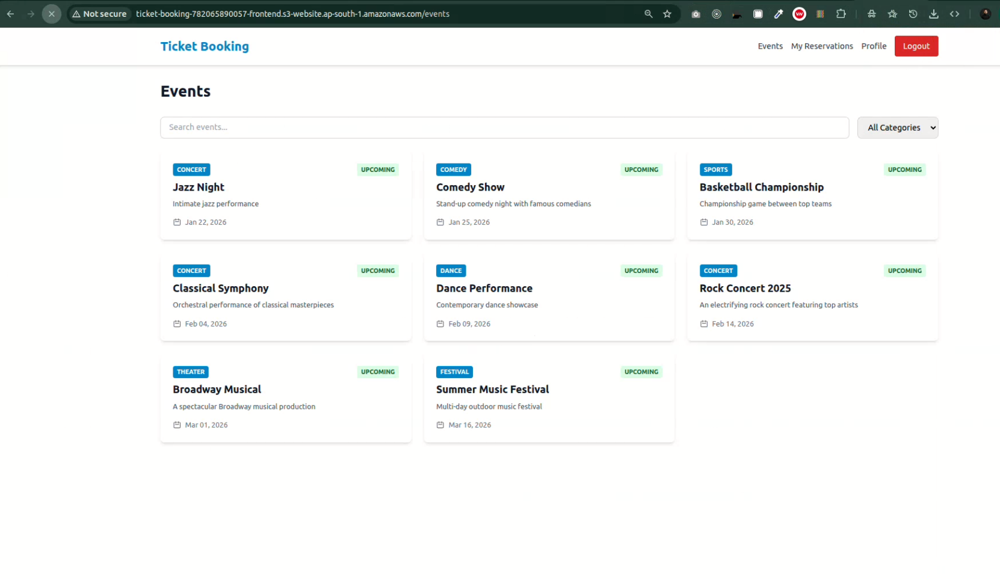
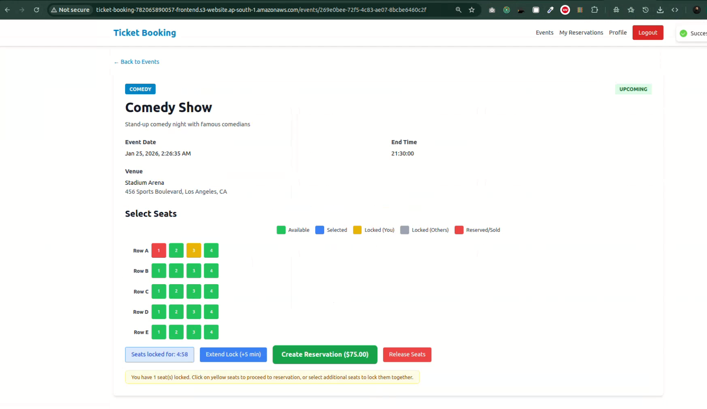
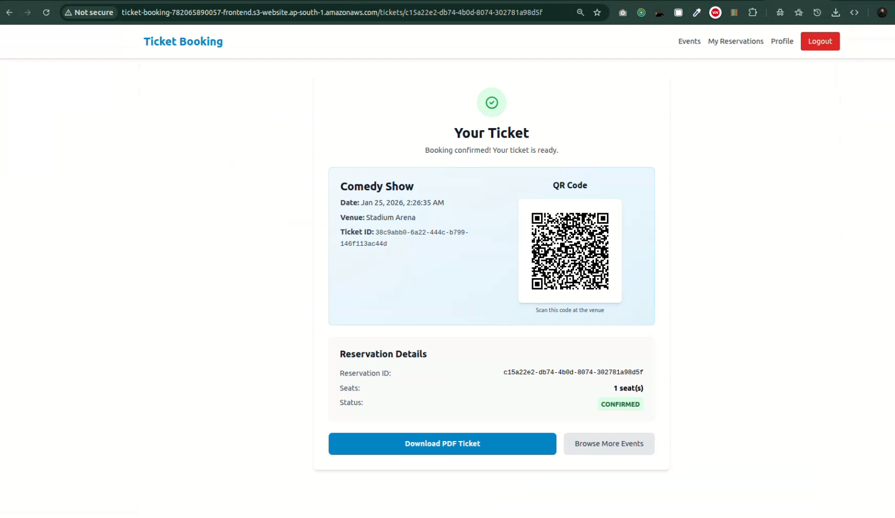

# 🎫 Cloud-Native Ticket Booking Platform

A production-ready, microservices-based ticket booking system built with modern cloud-native technologies. This project demonstrates end-to-end implementation of a distributed system with proper separation of concerns, asynchronous messaging, and AWS deployment.

[](https://www.typescriptlang.org/)
[](https://nestjs.com/)
[](https://reactjs.org/)
[](https://www.docker.com/)
[](https://aws.amazon.com/)

---

## Table of Contents

- [Overview](#overview)
- [Architecture](#architecture)
- [Features](#features)
- [Tech Stack](#tech-stack)
- [Prerequisites](#prerequisites)
- [Local Development Setup](#local-development-setup)
- [Testing](#testing)
- [AWS Deployment](#aws-deployment)
- [Project Structure](#project-structure)
- [API Documentation](#api-documentation)
- [Troubleshooting](#troubleshooting)
- [Contributing](#contributing)
- [License](#license)

---

## Overview

This is a **full-stack, cloud-native ticket booking platform** that allows users to browse events, select seats, make payments, and receive tickets via email. The system is built using a microservices architecture with proper domain separation, asynchronous message processing, and follows industry best practices for security, scalability, and observability.

### Key Highlights

- **8 Backend Microservices** built with NestJS (Auth, Event, Seat, Reservation, Payment, Ticket, Notification, API Gateway)
- **React Frontend** with modern UI/UX using Vite, Redux Toolkit, and Tailwind CSS
- **Distributed Architecture** with service discovery, message queues, and event-driven workflows
- **AWS Production Deployment** with ECS Fargate, RDS, S3, SQS, SES, and VPC best practices
- **Saga Pattern** for distributed transaction management in payment workflows
- **Real-time Seat Locking** using Redis for distributed locking
- **PDF Ticket Generation** stored in S3 with pre-signed URLs
- **Email Notifications** via AWS SES for booking confirmations

---

## Architecture

### High-Level Architecture

```
┌─────────────────────────────────────────────────────────────────────┐
│                         User Browser                                 │
└────────────────────────────┬────────────────────────────────────────┘
                             │
                             ▼
┌─────────────────────────────────────────────────────────────────────┐
│                   Frontend (React + Vite)                            │
│                   S3 Static Website Hosting                          │
└────────────────────────────┬────────────────────────────────────────┘
                             │
                             ▼
┌─────────────────────────────────────────────────────────────────────┐
│              Application Load Balancer (AWS ALB)                     │
└────────────────────────────┬────────────────────────────────────────┘
                             │
                             ▼
┌─────────────────────────────────────────────────────────────────────┐
│                      API Gateway Service                             │
│              (Request Routing, JWT Validation, Rate Limiting)        │
└────────────────────────────┬────────────────────────────────────────┘
                             │
         ┌───────────────────┴───────────────────┐
         │                                       │
         ▼                                       ▼
  ┌──────────────┐                      ┌──────────────┐
  │ Synchronous  │                      │ Asynchronous │
  │   Services   │                      │    Queues    │
  └──────┬───────┘                      └──────┬───────┘
         │                                     │
    ┌────┴────┬────────┬────────┐            │
    ▼         ▼        ▼        ▼            ▼
┌──────┐  ┌──────┐ ┌──────┐ ┌────────┐  ┌────────┐
│ Auth │  │Event │ │ Seat │ │Reserv  │  │ Ticket │
│:3001 │  │:3002 │ │:3003 │ │:3004   │  │:3006   │
└──┬───┘  └──┬───┘ └──┬───┘ └───┬────┘  └───┬────┘
   │         │        │         │           │
   ▼         ▼        ▼         ▼           ▼
┌──────┐  ┌──────┐ ┌──────┐ ┌──────┐   ┌──────┐
│ RDS  │  │ RDS  │ │Redis │ │ RDS  │   │  S3  │
│auth  │  │event │ │Cache │ │reserv│   │ PDFs │
│  DB  │  │  DB  │ │      │ │  DB  │   └──────┘
└──────┘  └──────┘ └──────┘ └──────┘

    ┌──────────┐              ┌──────────┐
    │ Payment  │              │  Notify  │
    │  :3005   │              │  :3007   │
    └────┬─────┘              └────┬─────┘
         │                         │
         ▼                         ▼
    ┌──────────┐              ┌──────────┐
    │   RDS    │              │   SES    │
    │ payment  │              │  Email   │
    │    DB    │              └──────────┘
    └────┬─────┘
         │
         ▼
    ┌──────────┐
    │   SQS    │
    │  Queues  │
    └──────────┘
```

### Microservices

| Service                  | Port | Responsibility                                  | Database          |
| ------------------------ | ---- | ----------------------------------------------- | ----------------- |
| **Auth Service**         | 3001 | User authentication, JWT management             | `auth_db`         |
| **Event Service**        | 3002 | Event management, venue information             | `event_db`        |
| **Seat Service**         | 3003 | Seat availability, locking (Redis)              | `seat_db`         |
| **Reservation Service**  | 3004 | Booking management, seat reservation            | `reservation_db`  |
| **Payment Service**      | 3005 | Payment processing (Saga pattern)               | `payment_db`      |
| **Ticket Service**       | 3006 | Ticket generation, PDF creation (S3)            | `ticket_db`       |
| **Notification Service** | 3007 | Email notifications (SES, SQS consumer)         | `notification_db` |
| **API Gateway**          | 3000 | Request routing, rate limiting, auth validation | N/A               |

---

## Features

### User Features

- **Event Browsing**: Browse events by category, search by name/location
- **Seat Selection**: Interactive seat map with real-time availability
- **Seat Locking**: Temporary seat locks (5 minutes) during checkout
- **Secure Payments**: Mock payment processing with Saga pattern
- **Ticket Generation**: PDF tickets with QR codes
- **Email Notifications**: Booking confirmations via email
- **Download Tickets**: Pre-signed S3 URLs for secure PDF downloads

### Technical Features

- **Microservices Architecture**: Fully decoupled services with clear boundaries
- **Service Discovery**: AWS Cloud Map for internal service communication
- **Asynchronous Processing**: SQS queues for ticket generation and notifications
- **Distributed Locking**: Redis-based seat locking to prevent double bookings
- **Saga Pattern**: Distributed transaction management for payment workflows
- **Health Checks**: Comprehensive health endpoints for all services
- **Database Per Service**: Each microservice owns its database
- **Migrations & Seeders**: TypeORM-based schema management and test data
- **Security**: JWT authentication, service-to-service auth, IAM roles
- **Observability**: CloudWatch Logs, structured logging
- **Infrastructure as Code**: Complete AWS CDK implementation for one-command deployment

---

## Tech Stack

### Backend

- **Framework**: [NestJS](https://nestjs.com/) 10.x (Node.js, TypeScript)
- **ORM**: [TypeORM](https://typeorm.io/) 0.3.x
- **Database**: PostgreSQL 14 (one DB per service)
- **Cache**: Redis 7.x (seat locking, rate limiting)
- **Message Queue**: AWS SQS
- **Email**: AWS SES
- **Storage**: AWS S3 (ticket PDFs, event images)
- **PDF Generation**: PDFKit

### Frontend

- **Framework**: [React](https://reactjs.org/) 18.x
- **Build Tool**: [Vite](https://vitejs.dev/) 4.x
- **State Management**: Redux Toolkit
- **Styling**: Tailwind CSS 3.x
- **Routing**: React Router v6
- **HTTP Client**: Axios
- **Toast Notifications**: react-hot-toast
- **QR Codes**: qrcode.react

### Infrastructure & DevOps

- **Containerization**: Docker, Docker Compose
- **Orchestration**: AWS ECS Fargate
- **Load Balancer**: AWS Application Load Balancer (ALB)
- **Service Discovery**: AWS Cloud Map
- **Secrets Management**: AWS Secrets Manager
- **Networking**: AWS VPC (public/private subnets, NAT Gateway, VPC Endpoints)
- **CI/CD**: GitHub Actions (optional)
- **IaC**: AWS CDK / Terraform (optional)

---

## Prerequisites

### Required

- **Node.js**: v18.x or v20.x
- **npm**: v9.x or later
- **Docker**: v20.x or later
- **Docker Compose**: v2.x or later
- **PostgreSQL**: 14.x (via Docker)
- **Redis**: 7.x (via Docker)

### For AWS Deployment

- **AWS CLI**: v2.x (for AWS deployment)
- **AWS Account** with appropriate permissions (for AWS deployment)

---

## Local Development Setup

### 1. Clone the Repository

```bash
git clone https://github.com/your-username/ticket-booking-system.git
cd ticket-booking-system
```

### 2. Install Dependencies

```bash
# Install backend dependencies for all services
cd backend/services
for service in */; do
  cd "$service"
  npm install
  cd ..
done

# Install frontend dependencies
cd ../../frontend
npm install
```

### 3. Setup Environment Variables

Each service needs a `.env` file. Copy from `.env.example`:

```bash
# Backend services
cd backend/services
for service in */; do
  cp "$service/.env.example" "$service/.env"
done

# Frontend
cd ../../frontend
cp .env.example .env
```

**Edit `.env` files** with your local configuration:

- Database credentials (use defaults for Docker setup)
- Redis connection (use localhost:6379 for local)
- JWT secret (generate a random string)
- For local development, use LocalStack for AWS services (S3, SQS, SES)

### 4. Start Infrastructure (Docker Compose)

```bash
docker-compose up -d

# Verify services are running
docker-compose ps

# Expected containers:
# - postgres (PostgreSQL)
# - redis
# - localstack (mock AWS services)
```

### 5. Run Database Migrations

**How databases are created:**

- The PostgreSQL container automatically creates the **databases** (auth_db, event_db, etc.) on first startup via the `init-db.sql` script
- **Migrations** then create the **tables** (users, events, seats, etc.) inside each database

Now run migrations for each service to create the tables:

#### Option A: Running Services with npm (from host)

If you plan to run services with `npm run start:dev` (Step 7, Option A):

```bash
# Navigate to services directory
cd backend/services

# Run migrations for each service
cd auth-service && npm run migration:run && cd ..
cd event-service && npm run migration:run && cd ..
cd seat-service && npm run migration:run && cd ..
cd reservation-service && npm run migration:run && cd ..
cd payment-service && npm run migration:run && cd ..
cd ticket-service && npm run migration:run && cd ..
cd notification-service && npm run migration:run && cd ..
```

#### Option B: Running Services in Docker Containers

If you're running services with Docker (Step 7, Option B):

```bash
# Run migrations inside Docker containers
docker-compose exec auth-service npm run migration:run
docker-compose exec event-service npm run migration:run
docker-compose exec seat-service npm run migration:run
docker-compose exec reservation-service npm run migration:run
docker-compose exec payment-service npm run migration:run
docker-compose exec ticket-service npm run migration:run
docker-compose exec notification-service npm run migration:run
```

**Verify migrations ran successfully:**

```bash
# Check if tables were created in each database
docker exec -it ticket-booking-postgres psql -U postgres -d auth_db -c "\dt"
docker exec -it ticket-booking-postgres psql -U postgres -d event_db -c "\dt"
docker exec -it ticket-booking-postgres psql -U postgres -d seat_db -c "\dt"
docker exec -it ticket-booking-postgres psql -U postgres -d reservation_db -c "\dt"
docker exec -it ticket-booking-postgres psql -U postgres -d payment_db -c "\dt"
docker exec -it ticket-booking-postgres psql -U postgres -d ticket_db -c "\dt"
docker exec -it ticket-booking-postgres psql -U postgres -d notification_db -c "\dt"

# Each database should show its tables (users, events, seats, reservations, etc.)
```

### 6. Seed Test Data (Optional)

Only **event-service** and **seat-service** have seeders. These will populate the database with sample events, venues, and seats.

#### Option A: Running Services with npm (from host)

```bash
# Navigate to services directory
cd backend/services

# Seed events and venues (Event Service)
cd event-service && npm run seed:run && cd ..

# Seed seats for events (Seat Service)
cd seat-service && npm run seed:run && cd ..
```

#### Option B: Running Services in Docker Containers

```bash
# Run seeders inside Docker containers
docker-compose exec event-service npm run seed:run
docker-compose exec seat-service npm run seed:run
```

**Verify seeders ran successfully:**

```bash
# Check events were created
docker exec -it ticket-booking-postgres psql -U postgres -d event_db -c "SELECT COUNT(*) FROM events;"

# Check seats were created
docker exec -it ticket-booking-postgres psql -U postgres -d seat_db -c "SELECT COUNT(*) FROM seats;"

# Should show multiple events and hundreds of seats
```

**Note:** Other services (auth, reservation, payment, ticket, notification) do not have seeders - their data is created dynamically during application usage.

### 7. Start Backend Services

**Option A: Using npm scripts** (recommended for development)

Open **8 terminal windows** and run each service:

```bash
# Terminal 1 - Auth Service
cd backend/services/auth-service
npm run start:dev

# Terminal 2 - Event Service
cd backend/services/event-service
npm run start:dev

# Terminal 3 - Seat Service
cd backend/services/seat-service
npm run start:dev

# Terminal 4 - Reservation Service
cd backend/services/reservation-service
npm run start:dev

# Terminal 5 - Payment Service
cd backend/services/payment-service
npm run start:dev

# Terminal 6 - Ticket Service
cd backend/services/ticket-service
npm run start:dev

# Terminal 7 - Notification Service
cd backend/services/notification-service
npm run start:dev

# Terminal 8 - API Gateway
cd backend/services/api-gateway
npm run start:dev
```

**Option B: Using Docker** (for testing the containerized setup)

```bash
# The main docker-compose.yml already includes all services
# Just start everything including backend services
docker-compose up -d

# View logs for all services
docker-compose logs -f

# View logs for specific service
docker-compose logs -f api-gateway
```

### 8. Start Frontend

```bash
cd frontend
npm run dev

# Frontend will start on http://localhost:5173
```

### 9. Access the Application

- **Frontend**: http://localhost:5173
- **API Gateway**: http://localhost:3000
- **Health Check**: http://localhost:3000/health

---

## Testing

### Manual Testing

1. **Register a User**:

   - Navigate to http://localhost:5173/register
   - Create an account

2. **Browse Events**:

   - Go to http://localhost:5173/events
   - View event details

3. **Select Seats**:

   - Click on an event → Select seats
   - Seats will be locked for 5 minutes

4. **Complete Booking**:

   - Proceed to payment
   - Use mock payment (any card number)
   - Receive ticket

5. **Download Ticket**:
   - View your ticket with QR code
   - Download PDF (stored in S3/LocalStack)

### API Testing with cURL

```bash
# Health Check
curl http://localhost:3000/health

# Register User
curl -X POST http://localhost:3000/api/auth/register \
  -H "Content-Type: application/json" \
  -d '{
    "email": "user@example.com",
    "password": "SecurePass123!",
    "firstName": "John",
    "lastName": "Doe"
  }'

# Login
curl -X POST http://localhost:3000/api/auth/login \
  -H "Content-Type: application/json" \
  -d '{
    "email": "user@example.com",
    "password": "SecurePass123!"
  }'

# Get Events (save the token from login)
export TOKEN="your-jwt-token"
curl http://localhost:3000/api/events \
  -H "Authorization: Bearer $TOKEN"
```

For complete testing guide, see **[docs/MANUAL_TESTING_GUIDE.md](docs/MANUAL_TESTING_GUIDE.md)**.

---

## AWS Deployment

This system is designed for production deployment on AWS using:

- **ECS Fargate** for containerized services
- **RDS PostgreSQL** for databases
- **Redis as ECS Task** (cost-effective alternative to ElastiCache)
- **Application Load Balancer (ALB)** for traffic routing
- **S3** for frontend hosting and ticket storage
- **SQS** for message queues
- **SES** for email delivery
- **CloudWatch** for logs and monitoring

### Option 1: Automated Deployment (Recommended) ⚡

Deploy everything with one command using AWS CDK:

```bash
cd infrastructure/cdk
npm install
npm run deploy
```

**Time:** 30-40 minutes | **Commands:** 1 | **Cost:** ~$113/month

See **[infrastructure/README.md](infrastructure/README.md)** for complete Infrastructure as Code guide.

### Option 2: Manual Deployment 📋

Follow the step-by-step manual deployment guide:

**Time:** 5+ hours | **Commands:** 100+ | **Cost:** ~$113/month

See **[docs/AWS_DEPLOYMENT_GUIDE.md](docs/AWS_DEPLOYMENT_GUIDE.md)** for complete manual deployment guide.

### Cleanup

To avoid ongoing AWS costs:

Follow the cleanup steps in the [AWS Deployment Guide](docs/AWS_DEPLOYMENT_GUIDE.md#phase-12-cleanup) to remove all resources in the correct order.

---

## Project Structure

```
ticket-booking-system/
├── backend/
│   └── services/
│       ├── auth-service/         # User authentication & JWT
│       ├── event-service/        # Event & venue management
│       ├── seat-service/         # Seat availability & locking
│       ├── reservation-service/  # Booking management
│       ├── payment-service/      # Payment processing (Saga)
│       ├── ticket-service/       # Ticket generation & PDF
│       ├── notification-service/ # Email notifications (SQS consumer)
│       └── api-gateway/          # Request routing & validation
├── frontend/                     # React frontend (Vite)
│   ├── src/
│   │   ├── components/          # Reusable UI components
│   │   ├── pages/               # Page components
│   │   ├── services/            # API clients
│   │   ├── store/               # Redux store & slices
│   │   └── types/               # TypeScript types
│   └── public/                  # Static assets
├── infrastructure/               # Infrastructure as Code (AWS CDK)
│   └── cdk/                     # AWS CDK implementation
│       ├── bin/app.ts           # CDK app entry point
│       ├── lib/                 # Infrastructure stacks
│       │   ├── vpc-stack.ts     # VPC, subnets, NAT, endpoints
│       │   ├── database-stack.ts # RDS + Redis
│       │   ├── storage-stack.ts  # S3 + SQS
│       │   ├── ecs-cluster-stack.ts # ECS cluster + tasks
│       │   ├── ecs-services-stack.ts # ECS services + ALB
│       │   └── frontend-stack.ts # S3 + CloudFront
│       ├── config/config.ts     # Deployment configuration
│       └── README.md            # CDK deployment guide
├── docs/                        # Documentation
│   ├── AWS_DEPLOYMENT_GUIDE.md  # Complete AWS deployment guide
│   ├── MANUAL_TESTING_GUIDE.md  # Testing guide
│   └── postman/                 # Postman API collection
├── docker-compose.yml           # Local development (all services)
├── .gitignore                   # Git ignore rules
├── README.md                    # This file
├── CONTRIBUTING.md              # Contribution guidelines
└── LICENSE                      # License information
```

---

## API Documentation

### Base URL

- **Local**: `http://localhost:3000/api`
- **AWS**: `https://your-alb-dns.amazonaws.com/api`

### Endpoints

#### Authentication

- `POST /auth/register` - Register new user
- `POST /auth/login` - Login user
- `POST /auth/refresh` - Refresh JWT token
- `GET /auth/profile` - Get user profile (authenticated)

#### Events

- `GET /events` - List all events (public)
- `GET /events/:id` - Get event details (public)
- `POST /events` - Create event (admin only)

#### Seats

- `GET /seats/event/:eventId` - Get seats for event
- `POST /seats/lock` - Lock seats temporarily
- `POST /seats/unlock` - Unlock seats

#### Reservations

- `POST /reservations` - Create reservation
- `GET /reservations/:id` - Get reservation details
- `GET /reservations/user/:userId` - Get user reservations

#### Payments

- `POST /payments` - Process payment
- `GET /payments/:id` - Get payment status

#### Tickets

- `GET /tickets/reservation/:reservationId` - Get ticket by reservation
- `GET /tickets/:id/download` - Get PDF download URL

For detailed API testing, import the Postman collection from **[docs/postman/](docs/postman/)** which includes all endpoints with request/response examples.

---

## Troubleshooting

### Common Issues

#### 1. Services Can't Connect to Database

**Problem**: `ECONNREFUSED` or `getaddrinfo ENOTFOUND`

**Solution**:

```bash
# Check if Docker containers are running
docker-compose ps

# Restart infrastructure
docker-compose down
docker-compose up -d

# Verify PostgreSQL is accessible
docker exec -it ticket-booking-postgres psql -U postgres -c "SELECT 1"
```

#### 2. Migrations Fail

**Problem**: `relation already exists` or `migration failed`

**Solution**:

```bash
# Drop and recreate databases (⚠️ data loss)
docker exec -it ticket-booking-postgres psql -U postgres

# In psql, drop and recreate databases:
DROP DATABASE IF EXISTS auth_db;
DROP DATABASE IF EXISTS event_db;
DROP DATABASE IF EXISTS seat_db;
DROP DATABASE IF EXISTS reservation_db;
DROP DATABASE IF EXISTS payment_db;
DROP DATABASE IF EXISTS ticket_db;
DROP DATABASE IF EXISTS notification_db;

CREATE DATABASE auth_db;
CREATE DATABASE event_db;
CREATE DATABASE seat_db;
CREATE DATABASE reservation_db;
CREATE DATABASE payment_db;
CREATE DATABASE ticket_db;
CREATE DATABASE notification_db;

# Re-run migrations
cd backend/services/auth-service
npm run migration:run
```

#### 3. Redis Connection Errors

**Problem**: `Error connecting to Redis`

**Solution**:

```bash
# Check Redis is running
docker-compose ps redis

# Test Redis connection (with password)
docker exec -it ticket-booking-redis redis-cli -a redispassword PING
# Should return: PONG

# Restart Redis
docker-compose restart redis
```

#### 4. Frontend Can't Reach API

**Problem**: CORS errors or network errors

**Solution**:

- Check `.env` in frontend has correct `VITE_API_URL`
- Verify API Gateway is running on port 3000
- Check browser console for CORS errors

#### 5. LocalStack (AWS Services) Issues

**Problem**: S3 upload fails, SQS messages not received, or LocalStack not ready

**Solution**:

```bash
# Check LocalStack is running and healthy
docker-compose ps localstack

# Check LocalStack health
curl http://localhost:4566/_localstack/health

# Restart LocalStack (will reinitialize S3/SQS/SES)
docker-compose restart localstack

# Wait for LocalStack to be fully ready (30-60 seconds)
# Then restart services that depend on it
docker-compose restart ticket-service notification-service event-service
```

**Verify LocalStack resources:**

```bash
# Check S3 buckets
aws --endpoint-url=http://localhost:4566 s3 ls

# Check SQS queues
aws --endpoint-url=http://localhost:4566 sqs list-queues

# Expected buckets: ticket-booking-event-images, ticket-booking-tickets-pdf
# Expected queues: ticket-generation-queue, notification-queue, reservation-expiry-queue
```

For more detailed troubleshooting, check service logs:

```bash
# Check specific service logs (Docker)
docker-compose logs -f api-gateway
docker-compose logs -f auth-service
docker-compose logs -f ticket-service

# View all service logs
docker-compose logs -f

# If running with npm (Option A)
# Check the terminal where each service is running
```

---

## Contributing

Contributions are welcome! Please follow these steps:

1. **Fork the repository**
2. **Create a feature branch**: `git checkout -b feature/amazing-feature`
3. **Commit your changes**: `git commit -m 'Add amazing feature'`
4. **Push to the branch**: `git push origin feature/amazing-feature`
5. **Open a Pull Request**

### Development Guidelines

- Follow TypeScript best practices
- Write unit tests for new features
- Update documentation for significant changes
- Follow existing code style (use ESLint/Prettier)
- Ensure all services pass health checks

---

## License

This project is licensed under the **MIT License** - see the [LICENSE](LICENSE) file for details.

---

## Acknowledgments

- **NestJS** for the excellent backend framework
- **React** and **Vite** for modern frontend development
- **AWS** for cloud infrastructure
- **Docker** for containerization
- Open-source community for amazing tools and libraries

---

## Contact & Support

- **GitHub Issues**: [Report bugs or request features](https://github.com/mehulmorker/ticket-booking-system/issues)
- **Email**: mehulmorker@outlook.com
- **LinkedIn**: [Mehul Morker](https://www.linkedin.com/in/mehulmorker/)

---

## Project Goals & Learning

This project was built as a learning exercise to demonstrate:

- Microservices architecture patterns
- Cloud-native application design
- AWS infrastructure best practices
- Modern TypeScript/React development
- DevOps practices (Docker, CI/CD, IaC)
- Production-ready system design

**Star ⭐ this repository if you found it helpful!**

---

## Screenshots

<!-- Add your screenshots here when ready -->

### Event Browsing


_Browse available events with categories and search_

### Seat Selection


_Interactive seat map with real-time availability_

### Ticket View


_Generated ticket with QR code and download option_

---

## Demo Video

[▶️ Watch Full Demo Video](https://bit.ly/3NfbDVg)

---

**Built with ❤️ using modern cloud-native technologies**
